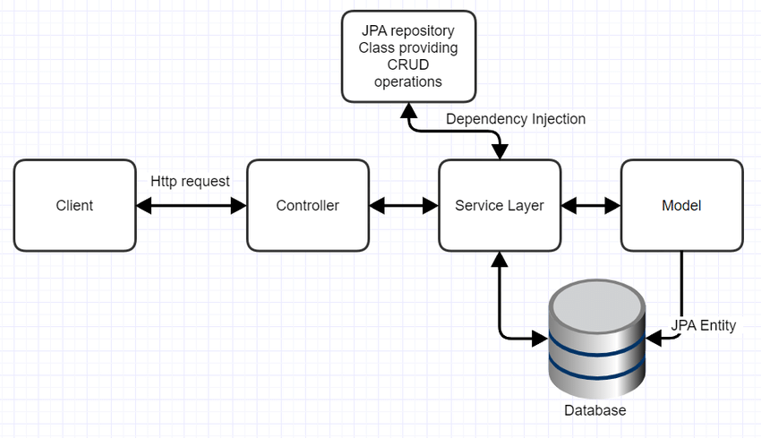

# employeeWork
 This is the project for the managing the details of the Employee

# FLOW OF THE PROJECT 

This is the flow of my project of the Entity Employee that involves the four packages
1. Entity (client)
2. Repository (JPA repository)
3. Services 
4. controller (controlling all request of the API)

# Security
This project use the JWT security for the improving the security to the generating the code and password to be used
